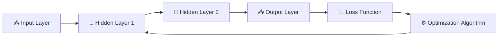

# 🚀 Harish Babu Marella
## 💻 .NET Developer | 🤖 AI & Machine Learning Enthusiast | ☁️ Cloud Computing Learner

---

# 🌟 Welcome to My Professional Portfolio

---

# 📖 Introduction

Hello and welcome to my professional portfolio repository.

My name is **Harish Babu Marella**, and I am a passionate **.NET Developer** with strong interests in:

- 🤖 Artificial Intelligence
- 🧠 Machine Learning
- ☁️ Cloud Computing
- 📊 Data Analytics
- 💻 Software Development
- 🚀 Emerging Technologies

This portfolio represents my academic learning journey, technical projects, professional growth, and continuous learning mindset in modern technology domains.

I enjoy exploring innovative technologies and understanding how intelligent systems can solve real-world business and software problems. My goal is to become a highly skilled technology professional capable of building scalable, intelligent, and impactful solutions.

This repository highlights my understanding of Artificial Intelligence concepts, Machine Learning algorithms, application domains, and practical use cases while demonstrating my ability to present technical information professionally.

---

# 👨‍💻 About Me

## 🌟 Professional Biography

I am a technology enthusiast with experience and learning interests focused on modern software development and Artificial Intelligence technologies.

My technical background includes:

✅ C#  
✅ .NET Core  
✅ SQL  
✅ REST APIs  
✅ Backend Development  
✅ Software Application Design  
✅ Machine Learning Concepts  
✅ Artificial Intelligence Fundamentals  

I enjoy learning how modern technologies can improve:
- Automation
- Business intelligence
- User experiences
- Productivity
- Decision-making systems

Apart from technology, I enjoy:
- ✈️ Traveling
- 🌍 Exploring different cultures
- 📚 Learning emerging technologies
- 💡 Researching innovative solutions

I strongly believe that:
> “Continuous learning and adaptability are the keys to success in the technology industry.”

---

# 🎯 Career Objectives

## 🚀 My Professional Goals

My long-term career objective is to become a highly skilled software and AI professional who can design intelligent, scalable, and impactful solutions.

### 📌 Areas I Want to Specialize In

- Artificial Intelligence
- Machine Learning
- Generative AI
- Cloud Computing
- Backend Architecture
- Intelligent Software Systems
- Data Analytics

### 📌 My Professional Vision

I aim to combine:
- Traditional Software Development
- AI Technologies
- Business Intelligence
- Automation Systems

to create meaningful and innovative solutions that improve organizations and user experiences.

---

# 🤖 AI & Machine Learning Portfolio Artifact

---

# 📘 Description

This portfolio artifact focuses on major Artificial Intelligence and Machine Learning algorithms and their application domains.

The project explains:
- Supervised Learning
- Unsupervised Learning
- Deep Learning
- Natural Language Processing
- Generative AI
- Computer Vision

The artifact also demonstrates how machine learning algorithms are applied in real-world industries such as healthcare, finance, business analytics, education, and software systems.

---

# 🎯 Objective

The main objectives of this project are:

✅ Understand major Machine Learning algorithms  
✅ Classify algorithms by learning type  
✅ Explain real-world AI applications  
✅ Explore NLP, Computer Vision, and Generative AI  
✅ Present technical concepts professionally  
✅ Build a professional portfolio artifact  

---

# ⚙️ Project Development Process

## 🔹 Step 1 — Research AI Concepts

Studied Artificial Intelligence, Machine Learning, NLP, Computer Vision, and Generative AI concepts using educational resources and AI documentation.

---

## 🔹 Step 2 — Analyze Algorithms

Analyzed how different Machine Learning algorithms work and identified their:
- Learning styles
- Functionalities
- Real-world applications

---

## 🔹 Step 3 — Categorize Algorithms

Organized algorithms into:
- Supervised Learning
- Unsupervised Learning
- Deep Learning
- Generative AI

---

## 🔹 Step 4 — Identify Domains

Explored AI domains including:
- 📊 Tabular Data
- 👁️ Computer Vision
- 🗣️ NLP
- 🎨 Generative AI

---

## 🔹 Step 5 — Build Professional Portfolio

Designed and documented all findings in GitHub using professional markdown formatting and visual presentation techniques.

---

# 🧠 Machine Learning Algorithms Included

| 🚀 Algorithm | 📚 Type | 🌍 Domain | 💡 Real-World Application |
|---|---|---|---|
| 🌳 Decision Tree | Supervised Learning | Tabular Data | Loan Approval Prediction |
| 🌲 Random Forest | Supervised Learning | Predictive Analytics | Fraud Detection |
| 📈 Linear Regression | Supervised Learning | Numerical Prediction | House Price Prediction |
| 🔍 K-Means Clustering | Unsupervised Learning | Data Segmentation | Customer Grouping |
| 👁️ CNN | Deep Learning | Computer Vision | Face Recognition |
| 🧠 GPT Models | Generative AI | NLP | Chatbots & Content Generation |
| 💬 BERT | Transformer Model | NLP | Sentiment Analysis |
| 🎨 Stable Diffusion | Generative AI | Image Generation | AI Art Creation |

---

# 🌍 Application Domains

---

## 📊 Tabular Data

Used for:
- Business analytics
- Financial predictions
- Risk analysis
- Customer insights

### Common Algorithms
- Decision Trees
- Random Forest
- Linear Regression

---

## 👁️ Computer Vision

Used for:
- Image recognition
- Medical imaging
- Object detection
- Face recognition

### Common Algorithms
- CNN
- YOLO
- ResNet

---

## 🗣️ Natural Language Processing (NLP)

Used for:
- Chatbots
- Language translation
- Sentiment analysis
- Text summarization

### Common Models
- GPT
- BERT
- Transformers

---

## 🎨 Generative AI

Used for:
- AI image generation
- Text generation
- Content creation
- Video generation

### Common Models
- GPT Models
- Stable Diffusion
- GANs

---

# 🛠️ Tools and Technologies Used

---

| 💻 Technology | 🚀 Purpose |
|---|---|
| GitHub | Portfolio Hosting |
| Markdown | Professional Documentation |
| ChatGPT | Research Assistance |
| Canva | Visual Inspiration |
| VS Code | Editing |
| AI/ML Resources | Technical Learning |

---

# 💎 Value Proposition

This portfolio demonstrates my ability to:

✨ Understand AI concepts  
✨ Learn emerging technologies  
✨ Research technical topics  
✨ Present information professionally  
✨ Build organized technical documentation  
✨ Combine software development with AI learning  

This artifact reflects both technical understanding and professional presentation abilities.

---

# 🌟 Unique Value

What makes this portfolio unique is the combination of:

✅ Software Development Knowledge  
✅ AI & Machine Learning Learning Journey  
✅ Technical Research Skills  
✅ Professional Communication  
✅ Analytical Thinking  
✅ Continuous Learning Mindset  

I aim to bridge traditional software development with modern intelligent systems and Artificial Intelligence technologies.

---

# 📈 Skills Demonstrated

| 🔥 Technical Skills | 🚀 Professional Skills |
|---|---|
| .NET Development | Problem Solving |
| SQL | Communication |
| REST APIs | Analytical Thinking |
| AI Concepts | Research |
| Machine Learning | Organization |
| GitHub | Documentation |

---

# 📚 Reflection

While building this portfolio artifact, I improved my understanding of:

- Supervised Learning
- Unsupervised Learning
- NLP
- Computer Vision
- Generative AI

I learned how different Machine Learning algorithms solve different types of problems and how AI technologies are transforming industries worldwide.

This project also improved my:
- Research abilities
- Professional communication
- Technical organization
- Portfolio development skills

Most importantly, this assignment helped me connect my .NET development background with modern AI technologies and future career opportunities.

---

# 🌐 Future Learning Goals

## 🚀 Areas I Plan to Learn Further

- Advanced Machine Learning
- Deep Learning
- AI Model Deployment
- Cloud AI Services
- Data Engineering
- Full Stack AI Applications
- Generative AI Development

---

# 📬 Contact Information

## 📧 Email
### marella.harishbabu@gmail.com

---

## 🌐 Professional Interests

🤖 Artificial Intelligence  
🧠 Machine Learning  
☁️ Cloud Computing  
📊 Data Analytics  
💻 Software Development  
🎨 Generative AI  

---

# 📚 References

- AI & Machine Learning Course Resources  
- OpenAI Documentation  
- Research Articles on AI Technologies  
- Machine Learning Educational Resources  
- Generative AI Learning Materials  

---

# ⭐ Thank You for Visiting My Portfolio ⭐

## 🚀 “Technology and continuous learning create the future.”

---

# 🧠 Neural Network Visualization Portfolio Artifact

## 🤖 TensorFlow Playground & Neural Network Learning Analysis

---

# 🌟 Welcome to My Neural Network Visualization Artifact

---

# 📖 Introduction

This portfolio artifact focuses on understanding and visualizing how neural networks function using the **TensorFlow Playground** and **TensorFlow Embedding Projector**.

Neural networks are one of the most important technologies in Artificial Intelligence and Machine Learning. They are designed to process information similarly to how the human brain processes patterns and relationships.

This project explores:

- 🧠 Neural network architecture
- ⚙️ Layers and neurons
- 🔗 Weights and activation functions
- 📉 Loss functions and optimization algorithms
- 📊 Neural network training behavior
- 🎨 AI visualization techniques

The purpose of this project was to gain practical experience by experimenting with different neural network configurations and observing how changes impact:

✅ Accuracy  
✅ Complexity  
✅ Training speed  
✅ Model performance  

---

# 🎯 Artifact Objectives

---

## 🚀 Primary Goals

✅ Understand neural network architecture  
✅ Learn how layers and neurons process information  
✅ Explore activation functions and optimizers  
✅ Analyze loss reduction during training  
✅ Visualize AI learning behavior interactively  
✅ Observe the impact of noise and hidden layers  
✅ Build a professional AI portfolio artifact  
✅ Improve technical communication and documentation skills  

---

# 🧠 Neural Network Architecture

---

# 📊 Neural Network Flow

---

# 🧩 Neural Network Components

---

# 🔹 1. Layers

Layers are groups of neurons that process information step-by-step inside a neural network.

## 📌 Types of Layers

| 🧠 Layer Type | 🚀 Function |
|---|---|
| 📥 Input Layer | Receives original input data |
| 🧠 Hidden Layers | Detect patterns and relationships |
| 📤 Output Layer | Produces final predictions |

### 🌟 Importance of Layers

- Layers help neural networks gradually understand complex information.
- Each layer extracts more meaningful patterns from the data.
- Hidden layers increase the learning capability of the network.
- More layers can improve accuracy for complex problems.

---

# 🔹 2. Neurons

Neurons are the smallest computational units inside a neural network.

Each neuron:

✅ Receives data inputs  
✅ Performs calculations  
✅ Applies activation functions  
✅ Produces outputs  
✅ Sends information to the next layer  

### 🌟 Importance of Neurons

- Neurons identify relationships between inputs.
- Multiple neurons working together allow pattern recognition.
- Neural networks become smarter as neurons learn through training.

---

# 🔹 3. Weights

Weights determine how strongly one neuron influences another.

### 📌 Importance of Weights

✅ Strong weights increase influence  
✅ Weak weights reduce influence  
✅ Weights are adjusted during training  
✅ Learning occurs through weight optimization  

### 🌟 Why Weights Matter

Weights are one of the most important learning mechanisms in neural networks.  
During training, the model continuously updates weights to reduce errors and improve predictions.

---

# 🔹 4. Activation Functions

Activation functions decide whether neurons should activate and pass information forward.

## 📌 Common Activation Functions

| ⚡ Function | 🚀 Purpose |
|---|---|
| ReLU | Fast and widely used |
| Sigmoid | Produces probability-like outputs |
| Tanh | Handles positive and negative values |
| Linear | Used for simple relationships |

### 🌟 Importance of Activation Functions

- Allow nonlinear learning
- Improve decision-making ability
- Help networks solve complex problems
- Increase model flexibility

---

# 🔹 5. Loss Functions

Loss functions measure how incorrect the model’s predictions are.

### 📌 Purpose of Loss Functions

✅ Evaluate prediction errors  
✅ Guide model learning  
✅ Improve network accuracy  
✅ Help reduce mistakes during training  

### 🌟 Common Loss Functions

| 📉 Loss Function | 🚀 Usage |
|---|---|
| Mean Squared Error | Regression problems |
| Cross Entropy Loss | Classification problems |
| Binary Cross Entropy | Binary predictions |

---

# 🔹 6. Optimization Algorithms

Optimization algorithms improve neural network performance by adjusting weights.

## 📌 Common Optimizers

| ⚙️ Optimizer | 🚀 Role |
|---|---|
| Gradient Descent | Reduces errors step-by-step |
| Adam Optimizer | Faster adaptive learning |
| RMSProp | Stabilizes learning performance |

### 🌟 Importance of Optimization

Optimization algorithms:
- Improve model accuracy
- Speed up training
- Reduce prediction errors
- Help networks learn efficiently

---

# 🧪 Neural Network Playground Experiments

---

# 🔬 Experiment 1 — Simple Dataset

Tested a neural network using a simple dataset with low noise.

## 📌 Observation

The model learned patterns quickly because the data was easy to classify.

## ✅ Results

- Faster training
- Lower loss
- Higher accuracy
- Clear decision boundaries

---

# 🔬 Experiment 2 — High Noise Dataset

Increased dataset noise levels.

## 📌 Observation

The model struggled more because noisy data created confusion during learning.

## ⚠️ Results

- Slower convergence
- Higher loss
- Lower prediction accuracy
- Increased training complexity

---

# 🔬 Experiment 3 — Additional Hidden Layers

Added more hidden layers to increase network depth.

## 📌 Observation

The model became more capable of learning complex relationships.

## ✅ Results

- Improved learning capability
- Better pattern recognition
- Increased computational complexity
- Longer training time

---

# 🔬 Experiment 4 — More Neurons

Increased the number of neurons inside hidden layers.

## 📌 Observation

The model detected patterns more effectively but became more computationally expensive.

## ✅ Results

- Better feature learning
- Higher flexibility
- Risk of overfitting
- More resource usage

---

# 🖼️ Visual Presentation Screenshots

---

# 📷 Add Your TensorFlow Screenshots Here

## 📌 Screenshot 1 — TensorFlow Playground Interface

> Insert screenshot here.

---

## 📌 Screenshot 2 — Basic Neural Network Model

> Insert screenshot here.

---

## 📌 Screenshot 3 — Multiple Hidden Layers Visualization

> Insert screenshot here.

---

## 📌 Screenshot 4 — Loss Reduction During Training

> Insert screenshot here.

---

## 📌 Screenshot 5 — High Noise Dataset Experiment

> Insert screenshot here.

---

## 📌 Screenshot 6 — Final Trained Neural Network

> Insert screenshot here.

---

## 📌 Screenshot 7 — TensorFlow Embedding Projector

> Insert screenshot here.

---

## 📌 Screenshot 8 — Word Embedding Visualization

> Insert screenshot here.

---

# 📊 Key Insights Learned

---

Through this project, I learned:

✅ Neural networks improve through optimization  
✅ Layers refine information progressively  
✅ Weights control neuron influence  
✅ Activation functions enable nonlinear learning  
✅ Loss functions guide model improvement  
✅ Noise negatively impacts learning performance  
✅ More layers increase model complexity  
✅ Visualization tools simplify AI understanding  
✅ Neural networks learn through repeated adjustments  

---

# 🌍 Real-World Applications of Neural Networks

---

| 🌎 Application Area | 🚀 Example |
|---|---|
| 👁️ Computer Vision | Face Recognition |
| 🗣️ NLP | Chatbots & Translation |
| 🚗 Autonomous Vehicles | Self-Driving Cars |
| 🏥 Healthcare | Disease Prediction |
| 💳 Finance | Fraud Detection |
| 🎵 Recommendation Systems | Netflix & Spotify Suggestions |

---

# 🛠️ Tools and Technologies Used

---

| 💻 Technology | 🚀 Purpose |
|---|---|
| TensorFlow Playground | Neural Network Simulation |
| TensorFlow Embedding Projector | Embedding Visualization |
| GitHub | Portfolio Hosting |
| Markdown | Professional Documentation |
| VS Code | Editing |
| AI/ML Educational Resources | Research and Learning |

---

# 💎 Value Proposition

This artifact demonstrates my ability to:

✨ Understand deep learning fundamentals  
✨ Analyze AI model behavior  
✨ Visualize neural network training  
✨ Explain technical AI concepts clearly  
✨ Build professional portfolio documentation  
✨ Connect theoretical concepts with practical experimentation  

---

# 🌟 Unique Value

This artifact is unique because it combines:

✅ Neural Network Theory  
✅ Interactive AI Visualization  
✅ Real-Time Training Analysis  
✅ Technical Documentation  
✅ Professional Presentation  
✅ Practical Machine Learning Learning Experience  

---

# 📚 Reflection

Working on this artifact significantly improved my understanding of neural networks and Artificial Intelligence systems.

By experimenting with the TensorFlow Playground, I observed how:
- Layers process information
- Neurons perform calculations
- Weights change during learning
- Activation functions affect training
- Loss functions measure prediction errors
- Optimization algorithms improve model performance

This assignment improved my:
- AI knowledge
- Research abilities
- Technical communication
- Visualization understanding
- Portfolio development skills

Most importantly, this artifact helped me connect theoretical classroom learning with practical neural network experimentation.

---

# 🧾 Summary

Neural network visualization is extremely important because it allows learners to understand how Artificial Intelligence systems process information internally.

This project demonstrated:
- Neural network architecture
- Learning behavior
- Error reduction
- Optimization processes
- Pattern recognition
- AI visualization techniques

Using TensorFlow Playground and Embedding Projector helped transform difficult AI concepts into understandable visual learning experiences.

---

# 🌐 Future Learning Goals

---

## 🚀 Areas I Plan to Learn Further

- Deep Neural Networks
- CNN Architectures
- Transformer Models
- Generative AI
- Explainable AI
- AI Model Deployment
- Large Language Models
- Cloud AI Services

---

# 📚 References

- TensorFlow Playground  
- TensorFlow Embedding Projector  
- Neural Network Educational Resources  
- TensorFlow Documentation  
- AI & Machine Learning Course Materials  

---

# ⭐ Thank You for Viewing My Neural Network Artifact ⭐

## 🚀 “Artificial Intelligence becomes meaningful when humans understand how it learns.”

---
