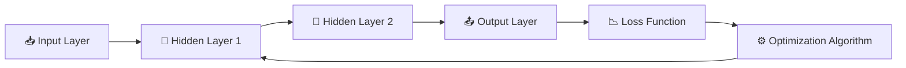

<div align="center">

# 🚀 Harish Babu Marella
## 💻 .NET Developer | 🤖 AI & Machine Learning Enthusiast | ☁️ Cloud Computing Learner


---

# 🌟 Welcome to My Professional Portfolio


</div>

---

# 📖 Introduction

Hello and welcome to my professional portfolio repository.

My name is **Harish Babu Marella**, and I am a passionate **.NET Developer** with strong interests in:

- 🤖 Artificial Intelligence
- 🧠 Machine Learning
- ☁️ Cloud Computing
- 📊 Data Analytics
- 💻 Software Development
- 🚀 Emerging Technologies

This portfolio represents my academic learning journey, technical projects, professional growth, and continuous learning mindset in modern technology domains.

I enjoy exploring innovative technologies and understanding how intelligent systems can solve real-world business and software problems. My goal is to become a highly skilled technology professional capable of building scalable, intelligent, and impactful solutions.

This repository highlights my understanding of Artificial Intelligence concepts, Machine Learning algorithms, application domains, and practical use cases while demonstrating my ability to present technical information professionally.

---

# 👨‍💻 About Me

<div align="center">


</div>

## 🌟 Professional Biography

I am a technology enthusiast with experience and learning interests focused on modern software development and Artificial Intelligence technologies.

My technical background includes:

✅ C#  
✅ .NET Core  
✅ SQL  
✅ REST APIs  
✅ Backend Development  
✅ Software Application Design  
✅ Machine Learning Concepts  
✅ Artificial Intelligence Fundamentals  

I enjoy learning how modern technologies can improve:
- Automation
- Business intelligence
- User experiences
- Productivity
- Decision-making systems

Apart from technology, I enjoy:
- ✈️ Traveling
- 🌍 Exploring different cultures
- 📚 Learning emerging technologies
- 💡 Researching innovative solutions

I strongly believe that:
> “Continuous learning and adaptability are the keys to success in the technology industry.”

---

# 🎯 Career Objectives

<div align="center">


</div>

## 🚀 My Professional Goals

My long-term career objective is to become a highly skilled software and AI professional who can design intelligent, scalable, and impactful solutions.

### 📌 Areas I Want to Specialize In

- Artificial Intelligence
- Machine Learning
- Generative AI
- Cloud Computing
- Backend Architecture
- Intelligent Software Systems
- Data Analytics

### 📌 My Professional Vision

I aim to combine:
- Traditional Software Development
- AI Technologies
- Business Intelligence
- Automation Systems

to create meaningful and innovative solutions that improve organizations and user experiences.

---

# 🤖 AI & Machine Learning Portfolio Artifact

<div align="center">


</div>

---

# 📘 Description

This portfolio artifact focuses on major Artificial Intelligence and Machine Learning algorithms and their application domains.

The project explains:
- Supervised Learning
- Unsupervised Learning
- Deep Learning
- Natural Language Processing
- Generative AI
- Computer Vision

The artifact also demonstrates how machine learning algorithms are applied in real-world industries such as healthcare, finance, business analytics, education, and software systems.

---

# 🎯 Objective

The main objectives of this project are:

✅ Understand major Machine Learning algorithms  
✅ Classify algorithms by learning type  
✅ Explain real-world AI applications  
✅ Explore NLP, Computer Vision, and Generative AI  
✅ Present technical concepts professionally  
✅ Build a professional portfolio artifact  

---

# ⚙️ Project Development Process

<div align="center">


</div>

## 🔹 Step 1 — Research AI Concepts

Studied Artificial Intelligence, Machine Learning, NLP, Computer Vision, and Generative AI concepts using educational resources and AI documentation.

---

## 🔹 Step 2 — Analyze Algorithms

Analyzed how different Machine Learning algorithms work and identified their:
- Learning styles
- Functionalities
- Real-world applications

---

## 🔹 Step 3 — Categorize Algorithms

Organized algorithms into:
- Supervised Learning
- Unsupervised Learning
- Deep Learning
- Generative AI

---

## 🔹 Step 4 — Identify Domains

Explored AI domains including:
- 📊 Tabular Data
- 👁️ Computer Vision
- 🗣️ NLP
- 🎨 Generative AI

---

## 🔹 Step 5 — Build Professional Portfolio

Designed and documented all findings in GitHub using professional markdown formatting and visual presentation techniques.

---

# 🧠 Machine Learning Algorithms Included

| 🚀 Algorithm | 📚 Type | 🌍 Domain | 💡 Real-World Application |
|---|---|---|---|
| 🌳 Decision Tree | Supervised Learning | Tabular Data | Loan Approval Prediction |
| 🌲 Random Forest | Supervised Learning | Predictive Analytics | Fraud Detection |
| 📈 Linear Regression | Supervised Learning | Numerical Prediction | House Price Prediction |
| 🔍 K-Means Clustering | Unsupervised Learning | Data Segmentation | Customer Grouping |
| 👁️ CNN | Deep Learning | Computer Vision | Face Recognition |
| 🧠 GPT Models | Generative AI | NLP | Chatbots & Content Generation |
| 💬 BERT | Transformer Model | NLP | Sentiment Analysis |
| 🎨 Stable Diffusion | Generative AI | Image Generation | AI Art Creation |

---

# 🌍 Application Domains

<div align="center">


</div>

---

## 📊 Tabular Data

Used for:
- Business analytics
- Financial predictions
- Risk analysis
- Customer insights

### Common Algorithms
- Decision Trees
- Random Forest
- Linear Regression

---

## 👁️ Computer Vision

Used for:
- Image recognition
- Medical imaging
- Object detection
- Face recognition

### Common Algorithms
- CNN
- YOLO
- ResNet

---

## 🗣️ Natural Language Processing (NLP)

Used for:
- Chatbots
- Language translation
- Sentiment analysis
- Text summarization

### Common Models
- GPT
- BERT
- Transformers

---

## 🎨 Generative AI

Used for:
- AI image generation
- Text generation
- Content creation
- Video generation

### Common Models
- GPT Models
- Stable Diffusion
- GANs

---

# 🛠️ Tools and Technologies Used

<div align="center">


</div>

---

| 💻 Technology | 🚀 Purpose |
|---|---|
| GitHub | Portfolio Hosting |
| Markdown | Professional Documentation |
| ChatGPT | Research Assistance |
| Canva | Visual Inspiration |
| VS Code | Editing |
| AI/ML Resources | Technical Learning |

---

# 💎 Value Proposition

This portfolio demonstrates my ability to:

✨ Understand AI concepts  
✨ Learn emerging technologies  
✨ Research technical topics  
✨ Present information professionally  
✨ Build organized technical documentation  
✨ Combine software development with AI learning  

This artifact reflects both technical understanding and professional presentation abilities.

---

# 🌟 Unique Value

<div align="center">


</div>

What makes this portfolio unique is the combination of:

✅ Software Development Knowledge  
✅ AI & Machine Learning Learning Journey  
✅ Technical Research Skills  
✅ Professional Communication  
✅ Analytical Thinking  
✅ Continuous Learning Mindset  

I aim to bridge traditional software development with modern intelligent systems and Artificial Intelligence technologies.

---

# 📈 Skills Demonstrated

| 🔥 Technical Skills | 🚀 Professional Skills |
|---|---|
| .NET Development | Problem Solving |
| SQL | Communication |
| REST APIs | Analytical Thinking |
| AI Concepts | Research |
| Machine Learning | Organization |
| GitHub | Documentation |

---

# 📚 Reflection

While building this portfolio artifact, I improved my understanding of:

- Supervised Learning
- Unsupervised Learning
- NLP
- Computer Vision
- Generative AI

I learned how different Machine Learning algorithms solve different types of problems and how AI technologies are transforming industries worldwide.

This project also improved my:
- Research abilities
- Professional communication
- Technical organization
- Portfolio development skills

Most importantly, this assignment helped me connect my .NET development background with modern AI technologies and future career opportunities.

---

# 🌐 Future Learning Goals

<div align="center">


</div>

## 🚀 Areas I Plan to Learn Further

- Advanced Machine Learning
- Deep Learning
- AI Model Deployment
- Cloud AI Services
- Data Engineering
- Full Stack AI Applications
- Generative AI Development

---

# 📬 Contact Information

<div align="center">

## 📧 Email
### marella.harishbabu@gmail.com

---

## 🌐 Professional Interests

🤖 Artificial Intelligence  
🧠 Machine Learning  
☁️ Cloud Computing  
📊 Data Analytics  
💻 Software Development  
🎨 Generative AI  

</div>

---

# 📚 References

- AI & Machine Learning Course Resources  
- OpenAI Documentation  
- Research Articles on AI Technologies  
- Machine Learning Educational Resources  
- Generative AI Learning Materials  

---

<div align="center">

# ⭐ Thank You for Visiting My Portfolio ⭐


## 🚀 “Technology and continuous learning create the future.”

</div>


---

<div align="center">

# 🧠 Neural Network Visualization Portfolio Artifact -2

## 🤖 TensorFlow Playground & Neural Network Learning Analysis


---

# 🌟 Welcome to My Neural Network Visualization Artifact


</div>

---

# 📖 Introduction

This portfolio artifact focuses on understanding and visualizing how neural networks function using the **TensorFlow Playground** and **TensorFlow Embedding Projector**.

Neural networks are one of the most important technologies in Artificial Intelligence and Machine Learning. They are designed to process information similarly to how the human brain processes patterns and relationships.

This project explores:

- 🧠 Neural network architecture
- ⚙️ Layers and neurons
- 🔗 Weights and activation functions
- 📉 Loss functions and optimization algorithms
- 📊 Neural network training behavior
- 🎨 AI visualization techniques

The purpose of this project was to gain practical experience by experimenting with different neural network configurations and observing how changes impact:

✅ Accuracy  
✅ Complexity  
✅ Training speed  
✅ Model performance  

---

# 🎯 Artifact Objectives

<div align="center">


</div>

---

## 🚀 Primary Goals

✅ Understand neural network architecture  
✅ Learn how layers and neurons process information  
✅ Explore activation functions and optimizers  
✅ Analyze loss reduction during training  
✅ Visualize AI learning behavior interactively  
✅ Observe the impact of noise and hidden layers  
✅ Build a professional AI portfolio artifact  
✅ Improve technical communication and documentation skills  

---

# 🧠 Neural Network Architecture

<div align="center">


</div>

---

# 📊 Neural Network Flow


```mermaid
flowchart LR
    A[📥 Input Layer] --> B[🧠 Hidden Layer 1]
    B --> C[🧠 Hidden Layer 2]
    C --> D[📤 Output Layer]
    D --> E[📉 Loss Function]
    E --> F[⚙️ Optimization Algorithm]
    F --> B
```

---

# 🧩 Neural Network Components

<div align="center">


</div>

---

# 🔹 1. Layers

Layers are groups of neurons that process information step-by-step inside a neural network.

## 📌 Types of Layers

| 🧠 Layer Type | 🚀 Function |
|---|---|
| 📥 Input Layer | Receives original input data |
| 🧠 Hidden Layers | Detect patterns and relationships |
| 📤 Output Layer | Produces final predictions |

### 🌟 Importance of Layers

- Layers help neural networks gradually understand complex information.
- Each layer extracts more meaningful patterns from the data.
- Hidden layers increase the learning capability of the network.
- More layers can improve accuracy for complex problems.

---

# 🔹 2. Neurons

<div align="center">


</div>

Neurons are the smallest computational units inside a neural network.

Each neuron:

✅ Receives data inputs  
✅ Performs calculations  
✅ Applies activation functions  
✅ Produces outputs  
✅ Sends information to the next layer  

### 🌟 Importance of Neurons

- Neurons identify relationships between inputs.
- Multiple neurons working together allow pattern recognition.
- Neural networks become smarter as neurons learn through training.

---

# 🔹 3. Weights

<div align="center">


</div>

Weights determine how strongly one neuron influences another.

### 📌 Importance of Weights

✅ Strong weights increase influence  
✅ Weak weights reduce influence  
✅ Weights are adjusted during training  
✅ Learning occurs through weight optimization  

### 🌟 Why Weights Matter

Weights are one of the most important learning mechanisms in neural networks.  
During training, the model continuously updates weights to reduce errors and improve predictions.

---

# 🔹 4. Activation Functions

<div align="center">


</div>

Activation functions decide whether neurons should activate and pass information forward.

## 📌 Common Activation Functions

| ⚡ Function | 🚀 Purpose |
|---|---|
| ReLU | Fast and widely used |
| Sigmoid | Produces probability-like outputs |
| Tanh | Handles positive and negative values |
| Linear | Used for simple relationships |

### 🌟 Importance of Activation Functions

- Allow nonlinear learning
- Improve decision-making ability
- Help networks solve complex problems
- Increase model flexibility

---

# 🔹 5. Loss Functions

<div align="center">


</div>

Loss functions measure how incorrect the model’s predictions are.

### 📌 Purpose of Loss Functions

✅ Evaluate prediction errors  
✅ Guide model learning  
✅ Improve network accuracy  
✅ Help reduce mistakes during training  

### 🌟 Common Loss Functions

| 📉 Loss Function | 🚀 Usage |
|---|---|
| Mean Squared Error | Regression problems |
| Cross Entropy Loss | Classification problems |
| Binary Cross Entropy | Binary predictions |

---

# 🔹 6. Optimization Algorithms

<div align="center">


</div>

Optimization algorithms improve neural network performance by adjusting weights.

## 📌 Common Optimizers

| ⚙️ Optimizer | 🚀 Role |
|---|---|
| Gradient Descent | Reduces errors step-by-step |
| Adam Optimizer | Faster adaptive learning |
| RMSProp | Stabilizes learning performance |

### 🌟 Importance of Optimization

Optimization algorithms:
- Improve model accuracy
- Speed up training
- Reduce prediction errors
- Help networks learn efficiently

---

# 🧪 Neural Network Playground Experiments

<div align="center">


</div>

---

# 🔬 Experiment 1 — Simple Dataset

<div align="center">


</div>

Tested a neural network using a simple dataset with low noise.

## 📌 Observation

The model learned patterns quickly because the data was easy to classify.

## ✅ Results

- Faster training
- Lower loss
- Higher accuracy
- Clear decision boundaries

---

# 🔬 Experiment 2 — High Noise Dataset

<div align="center">


</div>

Increased dataset noise levels.

## 📌 Observation

The model struggled more because noisy data created confusion during learning.

## ⚠️ Results

- Slower convergence
- Higher loss
- Lower prediction accuracy
- Increased training complexity

---

# 🔬 Experiment 3 — Additional Hidden Layers

<div align="center">


</div>

Added more hidden layers to increase network depth.

## 📌 Observation

The model became more capable of learning complex relationships.

## ✅ Results

- Improved learning capability
- Better pattern recognition
- Increased computational complexity
- Longer training time

---

# 🔬 Experiment 4 — More Neurons

<div align="center">


</div>

Increased the number of neurons inside hidden layers.

## 📌 Observation

The model detected patterns more effectively but became more computationally expensive.

## ✅ Results

- Better feature learning
- Higher flexibility
- Risk of overfitting
- More resource usage

---

# 🖼️ Visual Presentation Screenshots

<div align="center">


</div>

---

# 📷 Add Your TensorFlow Screenshots Here

## 📌 Screenshot 1 — TensorFlow Playground Interface


---


---


## 📌 Screenshot 2 — Basic Neural Network Model


---


---

# 📊 Key Insights Learned

<div align="center">


</div>

---

Through this project, I learned:

✅ Neural networks improve through optimization  
✅ Layers refine information progressively  
✅ Weights control neuron influence  
✅ Activation functions enable nonlinear learning  
✅ Loss functions guide model improvement  
✅ Noise negatively impacts learning performance  
✅ More layers increase model complexity  
✅ Visualization tools simplify AI understanding  
✅ Neural networks learn through repeated adjustments  

---

# 🌍 Real-World Applications of Neural Networks

<div align="center">


</div>

---

| 🌎 Application Area | 🚀 Example |
|---|---|
| 👁️ Computer Vision | Face Recognition |
| 🗣️ NLP | Chatbots & Translation |
| 🚗 Autonomous Vehicles | Self-Driving Cars |
| 🏥 Healthcare | Disease Prediction |
| 💳 Finance | Fraud Detection |
| 🎵 Recommendation Systems | Netflix & Spotify Suggestions |

---

# 🛠️ Tools and Technologies Used

<div align="center">


</div>

---

| 💻 Technology | 🚀 Purpose |
|---|---|
| TensorFlow Playground | Neural Network Simulation |
| TensorFlow Embedding Projector | Embedding Visualization |
| GitHub | Portfolio Hosting |
| Markdown | Professional Documentation |
| VS Code | Editing |
| AI/ML Educational Resources | Research and Learning |

---

# 💎 Value Proposition

This artifact demonstrates my ability to:

✨ Understand deep learning fundamentals  
✨ Analyze AI model behavior  
✨ Visualize neural network training  
✨ Explain technical AI concepts clearly  
✨ Build professional portfolio documentation  
✨ Connect theoretical concepts with practical experimentation  

---

# 🌟 Unique Value

<div align="center">


</div>

This artifact is unique because it combines:

✅ Neural Network Theory  
✅ Interactive AI Visualization  
✅ Real-Time Training Analysis  
✅ Technical Documentation  
✅ Professional Presentation  
✅ Practical Machine Learning Learning Experience  

---

# 📚 Reflection

Working on this artifact significantly improved my understanding of neural networks and Artificial Intelligence systems.

By experimenting with the TensorFlow Playground, I observed how:
- Layers process information
- Neurons perform calculations
- Weights change during learning
- Activation functions affect training
- Loss functions measure prediction errors
- Optimization algorithms improve model performance

This assignment improved my:
- AI knowledge
- Research abilities
- Technical communication
- Visualization understanding
- Portfolio development skills

Most importantly, this artifact helped me connect theoretical classroom learning with practical neural network experimentation.

---

# 🧾 Summary

Neural network visualization is extremely important because it allows learners to understand how Artificial Intelligence systems process information internally.

This project demonstrated:
- Neural network architecture
- Learning behavior
- Error reduction
- Optimization processes
- Pattern recognition
- AI visualization techniques

Using TensorFlow Playground and Embedding Projector helped transform difficult AI concepts into understandable visual learning experiences.

---

# 🌐 Future Learning Goals

<div align="center">


</div>

---

## 🚀 Areas I Plan to Learn Further

- Deep Neural Networks
- CNN Architectures
- Transformer Models
- Generative AI
- Explainable AI
- AI Model Deployment
- Large Language Models
- Cloud AI Services

---

# 📚 References

- TensorFlow Playground  
- TensorFlow Embedding Projector  
- Neural Network Educational Resources  
- TensorFlow Documentation  
- AI & Machine Learning Course Materials  

---

<div align="center">

# ⭐ Thank You for Viewing My Neural Network Artifact ⭐


## 🚀 “Artificial Intelligence becomes meaningful when humans understand how it learns.”

</div>

---


<div align="center">

# 🚀 Generative AI Training Pipeline & Infrastructure Analysis- ARTIFACT-3

## 🤖 Understanding How GPT-4, Claude, Gemini, and LLaMA Are Trained


---

# 🌟 Welcome to My Professional Portfolio Artifact


</div>

---

# 📖 Introduction

Generative Artificial Intelligence has emerged as one of the most transformative technologies of the modern era. Large Language Models (LLMs) such as GPT-4, Claude, Gemini, and LLaMA are capable of generating human-like text, answering questions, summarizing information, generating code, assisting with research, and supporting decision-making across industries.

Although these systems appear simple from a user perspective, they require an extremely sophisticated training process involving massive datasets, advanced computational infrastructure, billions of parameters, extensive engineering efforts, and substantial financial investments.

This portfolio artifact explores the complete lifecycle of Generative AI model development, from initial data collection through deployment. It also examines the computational resources, energy requirements, infrastructure costs, and training methodologies required to build modern Large Language Models.

---

# 👨‍💻 About Me

Hello, my name is **Harish Babu Marella**.

I am a .NET Developer and AI enthusiast with strong interests in Artificial Intelligence, Machine Learning, Data Analytics, Cloud Computing, and Intelligent Software Systems.

My goal is to combine traditional software engineering practices with emerging AI technologies to develop innovative, scalable, and impactful solutions that solve real-world problems.

This artifact demonstrates my ability to research, analyze, document, and visually communicate advanced AI concepts in a professional manner.

---

# 🎯 Project Objectives

### This artifact was developed to:

✅ Understand how Generative AI models are trained

✅ Explore the lifecycle of Large Language Models

✅ Analyze AI infrastructure requirements

✅ Investigate computational and financial costs

✅ Understand model alignment and safety testing

✅ Examine real-world examples of leading AI systems

✅ Develop professional documentation and presentation skills

---

# 🔄 Complete Large Language Model Training Lifecycle

```text
📚 DATA COLLECTION
        ↓
🧹 DATA CLEANING
        ↓
🧠 TOKENIZATION
        ↓
⚙️ PRETRAINING
        ↓
🎯 FINE-TUNING
        ↓
🛡️ ALIGNMENT & SAFETY TESTING
        ↓
🚀 DEPLOYMENT
        ↓
👥 USER INTERACTION
        ↓
📈 CONTINUOUS IMPROVEMENT
```

---

# 📚 Phase 1 – Data Collection

## Purpose

The first stage of training involves collecting enormous quantities of text and information from diverse sources.

### Common Sources

🌐 Public Websites

📚 Digital Books

📄 Research Publications

💻 Source Code Repositories

📰 News Articles

📖 Technical Documentation

🎓 Educational Content

### Importance

The breadth and quality of training data directly influence a model’s ability to understand language, answer questions, and perform reasoning tasks.

---

# 🧹 Phase 2 – Data Cleaning and Preparation

Raw internet data contains significant noise and quality issues.

### Removed Content

❌ Duplicate Information

❌ Corrupted Text

❌ Spam

❌ Low-Quality Content

❌ Harmful Material

❌ Irrelevant Data

### Result

Cleaner datasets improve model quality, reliability, and performance.

---

# 🧠 Phase 3 – Tokenization

Before training begins, text must be converted into smaller units called tokens.

### Example

Sentence:

Artificial Intelligence is transforming the world.

Tokens:

Artificial | Intelligence | is | transforming | the | world

### Purpose

Tokenization enables neural networks to process human language mathematically.

---

# ⚙️ Phase 4 – Pretraining

Pretraining represents the most computationally intensive phase.

### During Pretraining

The model learns:

- Grammar
- Language Patterns
- Context
- Reasoning Structures
- General Knowledge
- Problem Solving Approaches

### Resource Requirements

🖥️ Thousands of GPUs

⚡ Massive Electricity Usage

☁️ Large Cloud Infrastructure

💰 Millions of Dollars

⏳ Weeks or Months of Training

---

# 🎯 Phase 5 – Fine-Tuning

After pretraining, the model undergoes fine-tuning.

### Goals

✅ Improve Accuracy

✅ Improve Safety

✅ Improve Helpfulness

✅ Improve User Experience

### Techniques

- Supervised Fine-Tuning
- Reinforcement Learning from Human Feedback (RLHF)
- Preference Optimization

---

# 🛡️ Phase 6 – Safety Testing and Alignment

AI systems must be evaluated before public deployment.

### Risk Areas

⚠️ Bias

⚠️ Hallucinations

⚠️ Toxic Responses

⚠️ Security Vulnerabilities

⚠️ Misinformation

### Objective

Ensure responsible and trustworthy AI behavior.

---

# 🚀 Phase 7 – Deployment

After successful testing, models are released to users.

### Deployment Channels

🌐 Web Applications

📱 Mobile Applications

☁️ APIs

🏢 Enterprise Solutions

### Examples

🤖 ChatGPT

🤖 Claude

🤖 Gemini

🤖 LLaMA

---

# 📊 Resource Requirements Analysis

| Resource | Importance |
|-----------|------------|
| 📚 Training Data | Foundation of Model Knowledge |
| 🖥️ GPUs | Core Computational Power |
| ⚡ Energy | Supports Training Operations |
| ⏳ Time | Required for Learning Patterns |
| 💰 Funding | Supports Infrastructure and Research |
| 👨‍🔬 Engineers | Design and Optimization |

---

# 🤖 Model Comparison

| Model | Organization | Primary Focus |
|---------|-------------|--------------|
| GPT-4 | OpenAI | Conversational AI |
| Claude | Anthropic | AI Safety |
| Gemini | Google | Multimodal Intelligence |
| LLaMA | Meta | Open Research |

---

# 🛠️ Skills Demonstrated

- Generative AI
- Large Language Models
- AI Infrastructure Analysis
- Technical Research
- Data Analysis
- Documentation
- Professional Communication
- Portfolio Development

---

# 💎 Value Proposition

This project demonstrates my ability to understand complex AI systems, analyze technical infrastructure, conduct research, communicate findings effectively, and present advanced concepts in a professional format suitable for technical audiences.

---

# 📚 Reflection

Through this project, I gained a deeper understanding of the extensive resources required to develop modern AI systems. I learned that successful AI models depend not only on algorithms but also on high-quality datasets, massive computational resources, safety alignment techniques, and ongoing monitoring.

This artifact strengthened my research, technical writing, analytical thinking, and portfolio development skills while expanding my knowledge of Generative AI technologies.

---

# ⭐ Thank You for Visiting My Portfolio

### 🚀 "Understanding how AI is built is the first step toward building the future."

<div align="center">

# 🧠 Explainable AI, Validation & Performance Metrics
## 🔍 Trustworthy Generative AI Portfolio Artifact--4


---

## 🌟 Portfolio Artifact Overview

This artifact presents a professional infographic-style slide deck explaining how **Explainable AI (XAI)**, **validation techniques**, and **performance metrics** improve trust in modern generative AI systems such as GPT, Claude, Gemini, and LLaMA.

</div>

---

# 📖 Introduction

Generative AI systems are powerful, but they are also difficult to understand because their responses are produced through complex patterns learned from large datasets. This creates an important challenge: users, developers, organizations, and regulators need to know when AI outputs are reliable, when they may be biased, and when they require human review.

This portfolio artifact explains how explainability, validation, and performance metrics work together to make AI systems more transparent, accountable, and trustworthy.

---

# 📘 Description

This project focuses on the challenges and current solutions for explaining decisions made by large language models and other generative AI systems.

The artifact covers:

- 🧠 What Explainable AI means
- 🔍 Why AI transparency matters
- ⚠️ Major explainability challenges
- 📊 Validation and performance metrics
- 🛡️ Red-team testing and robustness checks
- 📄 Model cards and system cards
- 🏢 Current responsible AI practices from leading organizations

---

# 🎯 Objective

The main objectives of this artifact are:

✅ Define Explainable AI clearly  
✅ Explain why transparency is important in AI systems  
✅ Identify major challenges such as opacity, bias, complexity, and regulation  
✅ Demonstrate how validation and metrics support reliability  
✅ Summarize current explainability techniques used in industry  
✅ Present the findings in a professional visual portfolio format  

---

# ⚙️ Project Development Process

## 🔹 Step 1 — Research Explainable AI

Studied the meaning of XAI and why transparency is important for AI trust, safety, debugging, and accountability.

## 🔹 Step 2 — Analyze Explainability Challenges

Reviewed challenges such as black-box behavior, post-hoc explanation limitations, biased training data, hallucinations, and regulatory expectations.

## 🔹 Step 3 — Study Validation and Metrics

Analyzed how validation sets, benchmark testing, red teaming, fairness checks, hallucination measurement, and monitoring help evaluate AI systems.

## 🔹 Step 4 — Review Industry Practices

Explored how major AI organizations publish model cards, system cards, safety reports, and responsible-use guides to document model behavior and limitations.

## 🔹 Step 5 — Build Visual Artifact

Created a professional PowerPoint infographic that communicates the topic clearly for portfolio and academic submission.

---

# 🧩 Key Concepts Included

| 🧠 Concept | 🔍 Meaning | 💼 Professional Relevance |
|---|---|---|
| Explainable AI | Makes AI behavior easier to understand | Supports trust and accountability |
| Model Opacity | AI decisions are hard to trace directly | Shows awareness of AI limitations |
| Post-Hoc Explanations | Explanations created after model output | Requires careful validation |
| Data Bias | Outputs may reflect biased or noisy data | Supports responsible AI thinking |
| Validation | Tests performance on independent data | Measures model reliability |
| Red Teaming | Stress-tests AI with adversarial prompts | Improves robustness and safety |
| Model Cards | Documents model uses and limitations | Helps transparent deployment |
| Performance Metrics | Measures accuracy, robustness, fairness, and reliability | Converts trust into evidence |

---

# 🛠️ Tools and Technologies Used

<div align="center">


</div>

| 💻 Tool / Technology | 🚀 Purpose |
|---|---|
| PowerPoint | Visual infographic artifact |
| GitHub | Portfolio hosting |
| Markdown | Professional README documentation |
| ChatGPT | Research support and writing assistance |
| AI/ML documentation | Technical source material |
| VS Code | Portfolio editing |

---

# 💎 Value Proposition

This artifact demonstrates my ability to:

✨ Understand responsible AI concepts  
✨ Research complex AI/ML topics  
✨ Explain technical ideas clearly  
✨ Connect AI theory with real-world trust and validation practices  
✨ Create professional portfolio-ready documentation  
✨ Communicate AI risks, limitations, and safeguards effectively  

---

# 🌟 Unique Value

What makes this artifact unique is that it does not only explain AI capabilities. It focuses on **trust**, **transparency**, **validation**, and **accountability**, which are essential for responsible AI development.

This artifact connects my software development background with modern AI governance and evaluation practices, showing that I understand both technical implementation and responsible deployment.

---

# 📈 Skills Demonstrated

| 🔥 Technical Skills | 🚀 Professional Skills |
|---|---|
| AI/ML Concepts | Research |
| Generative AI Understanding | Technical Communication |
| Model Validation | Critical Thinking |
| Performance Metrics | Visual Presentation |
| Responsible AI | Documentation |
| GitHub Portfolio Development | Professional Organization |

---

# 📚 Reflection

While creating this artifact, I learned that AI trust is not based only on whether a model gives useful answers. Trust also depends on whether the model can be tested, measured, explained, documented, and monitored responsibly.

This project helped me understand how explainability, validation, and metrics work together to reduce risk and improve confidence in AI systems. It also strengthened my ability to present AI concepts professionally in a portfolio format.

---

# 🌐 Relevance to My Career Goals

As a .NET Developer and AI/ML learner, this artifact supports my goal of building intelligent and reliable software systems. Modern developers increasingly need to understand not only how to use AI tools, but also how to evaluate their reliability, fairness, safety, and limitations.

This artifact shows my ability to bridge software development, AI concepts, model evaluation, and responsible technology practices.

---

# 📚 References

- NIST Artificial Intelligence Risk Management Framework (AI RMF 1.0)
- OpenAI GPT-4o System Card
- Anthropic Claude System Cards
- Meta LLaMA Model Cards and Responsible Use Guide
- European Commission AI Act Overview

---

<div align="center">

# ⭐ Thank You for Reviewing My Portfolio Artifact ⭐

## 🚀 “Responsible AI becomes trustworthy when it is explainable, validated, measured, and monitored.”

</div>


